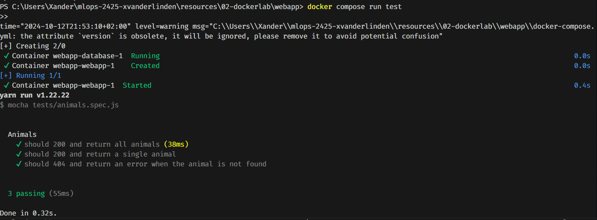
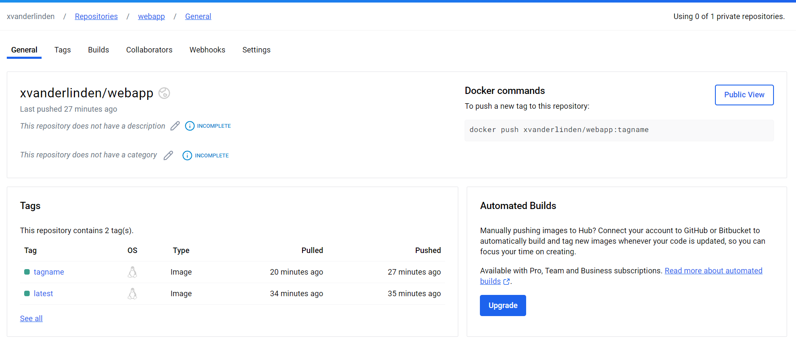
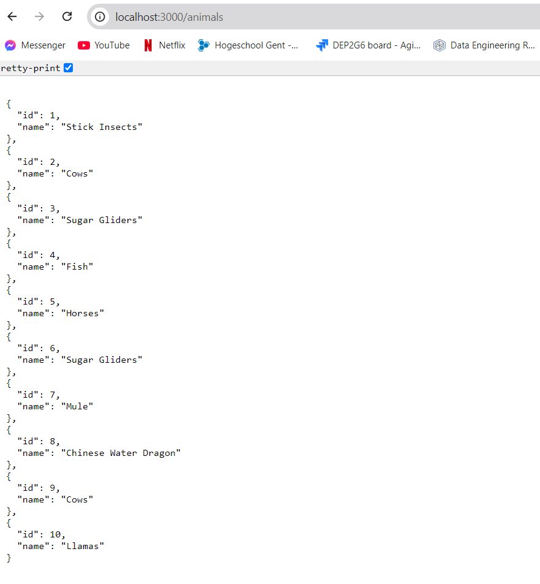

# Lab Report: Docker

## Student information

- Student name: Xander Van der Linden
- Student code: 202292316

## Assignment description

In dit Docker labo, moest ik een aantal Docker Images maken en optimalizeren voor een simpele web applicatie. Het uiteindelijke doel was om een Node.js API in een container te stoppen zodat deze bruikbaar was via poort 3000. De data werd opgeslaan aan de hand van volumes en werd geconnecteerd met een SQLite en MySQL Database. Ook werden deze images naar de Docker hub gepusht.

## Proof of work done

## Evaluation criteria

## Evaluation criteria

- [x] **Show that you created a Docker image for the API**
- [x] **Show that you can start the API using the SQLite database**
- [x] **Show that you can start the API using the MySQL database**
- [x] **Show that you can access the API on port 3000**
- [x] **Show that you optimized the Docker image size**
- [x] **You've used an Alpine version of Node.js**
- [x] **You've copied and installed the dependencies in a separate layer**
- [x] **Show all running containers in the Portainer dashboard**
- [x] **Show that all tests are passing**
- [x] **Show that you pushed the Docker image to Docker Hub and that you can pull it from Docker Hub**
- [x] **Show that you wrote an elaborate lab report in Markdown and pushed it to the repository**
- [x] **Show that you updated the cheat sheet with the commands you need to remember**

## Issues

"none."

## Reflection

### What was difficult?

Het moeilijkste was de juiste Docker compose file attributen vinden voor te verbinden met de 2 verschillende soorten databases.

### What was easy?

Een image maken voor de node.js API ging zeer vlot.

### What did you learn?

Ik weet nu hoe ik op een effictieve manier docker images maak en dees zo optimaal mogelijk deploy.

### What would you do differently?

Ik zou eerst de volledige opdracht lezen voor ik docker files begin te maken aangezien er heel wat aanpassingen moesten gebeuren bij later delen van de opdracht.

## Resources

- [Docker documentation](https://docs.docker.com/)
- [Docker Compose documentation](https://docs.docker.com/compose/)
- [Node.js Docker best practices](https://nodejs.org/en/docs/guides/nodejs-docker-webapp/)
