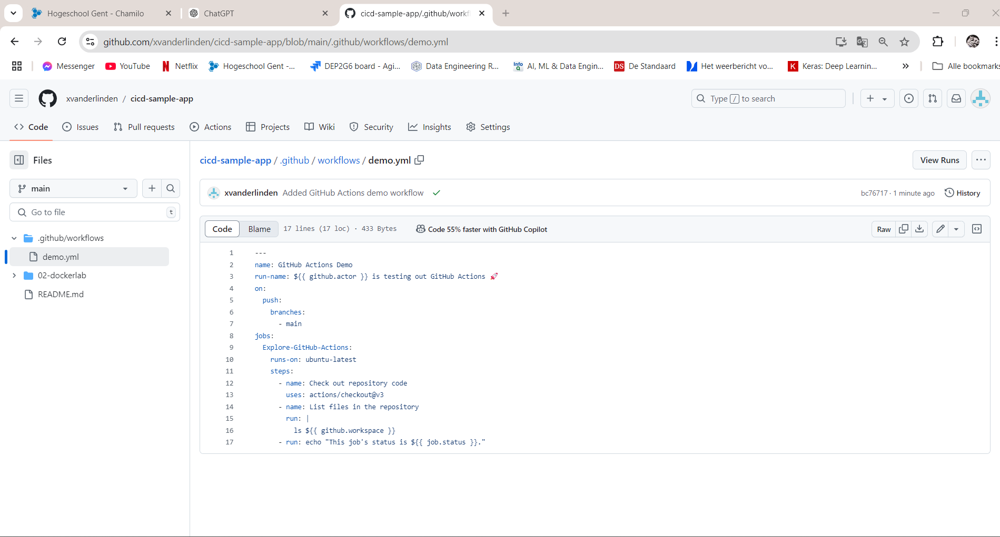
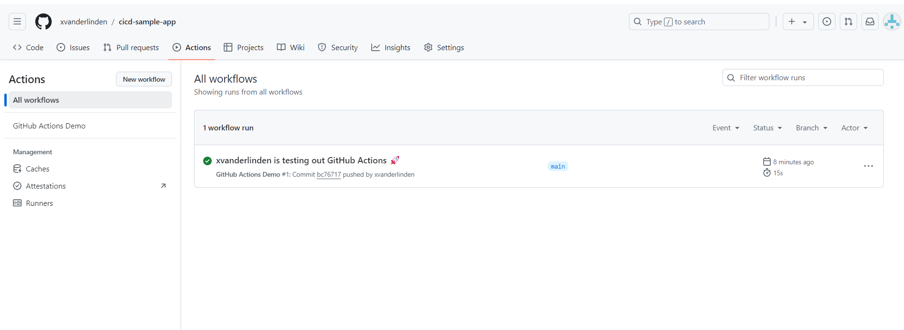
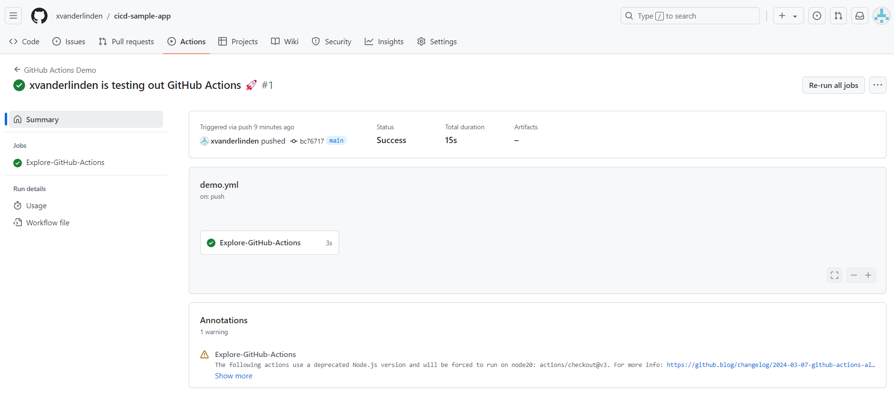
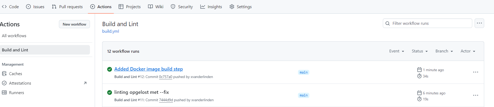
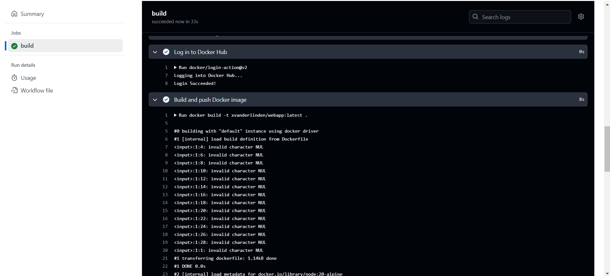

# Lab Report: CI/CD

## Student information

- Student name: Xander Van der Linden
- Student code: 202292316

## Assignment description

De opdracht draaide om het opzetten van een volledige Continuous Integration/Continuous Deployment (CI/CD) pipeline met behulp van GitHub Actions en Docker. Het doel was om de webapp met dieren van het vorige lab in een repository te plaatsen, die te testen, en automatisch te deployen in een Docker-container. Hierbij moest je een aantal stappen volgen, zoals:

-Je moest een nieuwe repository aanmaken op GitHub en de sample-applicatie daarin uploaden.

-Een workflow opzetten in GitHub Actions: Hier ging het om het automatiseren van de build- en testprocessen. Je moest meerdere workflows configureren die de code van de repository checkt, Node.js installeert, afhankelijkheden installeert, en vervolgens tests en een linter uitvoert.

-Docker image bouwen en pushen naar Docker Hub: Je moest een Docker image maken van de sample-applicatie, deze lokaal testen en vervolgens naar Docker Hub pushen, zodat anderen het kunnen gebruiken.

-Automatische triggers instellen: Telkens wanneer er een verandering in de code was (zoals een commit of push), moest de CI/CD pipeline automatisch opnieuw draaien, de code opnieuw testen en het Docker image bijwerken als alles succesvol was.

-Dependabot instellen: Je moest Dependabot activeren om automatisch pull requests te maken als een afhankelijkheid verouderd is of een update nodig heeft.

## Proof of work done

## Evaluation criteria

- [x]Show that you created a GitHub repository for the sample application
- [x]Show the overview of workflow runs in the GitHub Actions tab
- [x]Show that the application image is available on Docker Hub
- [x]Make a change to the sample application, commit and push, and show that the build pipeline is triggered automatically
- [x]Enable dependabot and show that it creates a PR if a dependency is outdated.
- [x]Show that you wrote an elaborate lab report in Markdown and pushed it to the repository
- [x]Show that you updated the cheat sheet with the commands you need to remember

## Issues

Ik ondervond heel wat problemen met de yarn lint uit te voeren. Door de oude eslintrc.json te migreren naar een nieuwe eslint.config.mjs met het commando npx @eslint/migrate-config .eslintrc.json en het commando yarn eslint . te gebruiken heb ik dit opgelost. In de Build.yml heb ik dit commando dan ook aangepast.

## Reflection

Buiten de problemen met de linter vond ik dit een zeer interessante opdracht aangezien ik nog nooit met github actions had gewerkt. Ik zie zeker het nut in van deze technologie en zal dit waarschijnlijk nog veel gebruiken in de toekomst. Als extra heb ik gezorgd dat de yarn test slaagde.

## Resources

<https://eslint.org/docs/latest/use/configure/migration-guide>
<https://github.com/features/actions>
