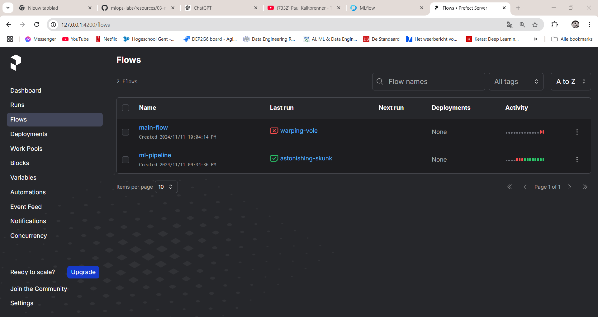

# Lab Report: MLflow

## Student information

- Student name: Xander Van der Linden
- Student code: 202292316

## Assignment description

Describe the assignment in your own words. What did you have to do? What was the goal of the assignment?

## Proof of work done

## Evaluation criteria

- [x] Show that you've executed the notebook and pushed it to the repository
  -[x]  Show that your Jupyter notebook contains all cells' output
- [x]Show that you created a virtual environment for the project
- [x]Show the Prefect and MLFlow dashboards
- [x]Show that your ML pipeline is working
- [x]Show the logs and metrics in the MLFlow dashboard
- [x]Show that you pushed a model to MLFlow
- [x]Show that you wrote an elaborate lab report in Markdown and pushed it to the repository
  - [x]Show that it contains the answers to the questions in the lab assignment
  - [x]Show that it contains the screenshots of the MLFlow dashboard
- [x]Show that you are able to make a prediction with the deployed model

## Issues

Ik had problemen met het opzetten van de virtuele enviroment. Er waren problemen met Versies van Keras
pip en Python. Ik had problemen met het MLflow script te runnen. Aangezien er enviromental variabelen
waren die niet correct waren ingesteld.Ook waren er problemen met de github Url en de directories

## Reflection

Ik leerde hoe ik een Machine learning pipeline opzetten en hergebruikte via MLflow. Nu ik weet hoe dit moet
is het zeker een nuttige skill voor in de praktijk te gebruiken. Het model van nu is niet zo bruikbaar aangezien
de dataset redelijk klein was. De Voorspellingen zijn dus niet mega accuraat.

## Antwoorden op vragen

## Antwoorden op de vragen

### Wat doet het commando `python3 -m venv venv`?

Dit commando maakt een nieuwe virtuele omgeving voor Python aan. Het is een geïsoleerde ruimte waar je de benodigde afhankelijkheden (zoals bibliotheken) kunt installeren voor je project, zonder dat dit invloed heeft op andere projecten of het systeem zelf.

### Wat betekent het eerste argument `venv`?

Het eerste `venv` is de naam van de virtuele omgeving die je wilt maken. Dit is de naam van de map waarin de virtuele omgeving wordt aangemaakt.

### Wat betekent het tweede `venv`?

Het tweede `venv` is de naam van de directory waarin de virtuele omgeving wordt aangemaakt. Dit kan je aanpassen naar een andere naam als je wilt, bijvoorbeeld `mijn_omgeving`.

### Welke van de twee kun je naar eigen voorkeur wijzigen?

Je kunt het tweede `venv` (de naam van de map) aanpassen. De eerste `venv` is de naam van de module die door Python wordt gebruikt om de virtuele omgeving aan te maken, dus die kun je niet wijzigen.

### Hoe zorg je ervoor dat je virtuele omgeving niet door Git wordt gevolgd?

Om ervoor te zorgen dat je virtuele omgeving niet door Git wordt gevolgd, voeg je de naam van de virtuele omgeving (bijvoorbeeld `venv/` of de naam van jouw virtuele omgeving) toe aan het `.gitignore`-bestand. Dit bestand zorgt ervoor dat Git de virtuele omgeving en andere tijdelijke bestanden negeert. Voeg de volgende regel toe aan het `.gitignore` 

venv/

### Waar worden de afhankelijkheden geïnstalleerd?

De afhankelijkheden worden geïnstalleerd in de virtuele omgeving zelf, meestal in de map venv in je projectdirectory. Dit zorgt ervoor dat de geïnstalleerde pakketten enkel beschikbaar zijn voor dit specifieke project, en niet voor andere projecten of systemen. De geïnstalleerde pakketten staan dus niet in de globale Python-installatie.

Waarom moeten we de omgeving variabele PREFECT_HOME instellen?
De omgeving variabele PREFECT_HOME wordt gebruikt om de opslaglocatie van de Prefect configuratie en runtime data aan te geven. Door deze variabele in te stellen, geef je aan waar Prefect zijn configuratiebestanden en logs moet opslaan. Dit is belangrijk omdat het Prefect systeem afhankelijk is van deze configuratie om de werkstromen goed te beheren.

Wat is het nut van het starten van de Prefect server?
Het starten van de Prefect server is nodig om toegang te krijgen tot het Prefect dashboard. Dit dashboard biedt een visuele interface voor het beheren en monitoren van je werkstromen (pipelines). Het stelt je in staat om de voortgang van taken te volgen, logs te bekijken en fouten te debuggen.

Hoe maak je een Prefect pipeline?
In de pipeline moet je verschillende taken (tasks) definiëren, zoals het downloaden van data, het voorverwerken van data, het trainen van het model en het evalueren van het model. Deze taken worden uitgevoerd in een bepaalde volgorde, wat je definieert met een flow.

Voorbeeld van de structuur van je pipeline:

Download data: Download de afbeeldingen van de GitHub repository.
Preprocess data: Verwerk de afbeeldingen voor en splits ze in trainings-, validatie- en testsets.
Train het model: Train een model op de trainingsset.
Evalueer het model: Evalueer het model op de testset.
Elke stap moet worden gedefinieerd als een Prefect taak en aan elkaar worden gekoppeld in de juiste volgorde met behulp van een Prefect flow.

Hoe log je experimenten en modelinformatie in MLFlow?
In MLFlow kun je experimenten en modelinformatie loggen door het instellen van de tracking URI en de experimentnaam in je script. Door gebruik te maken van MLFlow's autologging, kun je automatisch belangrijke informatie loggen, zoals modelparameters, metrics en zelfs het model zelf.

Autologging inschakelen: Voor het trainen en evalueren van het model kun je autologging inschakelen om automatisch de hyperparameters, metrics, modelgewichten en andere belangrijke informatie op te slaan. Je kunt bijvoorbeeld mlflow.keras.autolog() gebruiken om Keras modeltraining automatisch te loggen.

System metrics loggen: Door de omgevingsvariabele MLFLOW_ENABLE_SYSTEM_METRICS_LOGGING in te stellen op true, kun je systeemmetrics zoals CPU-gebruik, geheugenverbruik en andere statistieken loggen tijdens de uitvoering van je pipeline.

## Resources

<https://docs.prefect.io/3.0/develop/write-flows>
<https://docs.prefect.io/3.0/develop/write-tasks>
