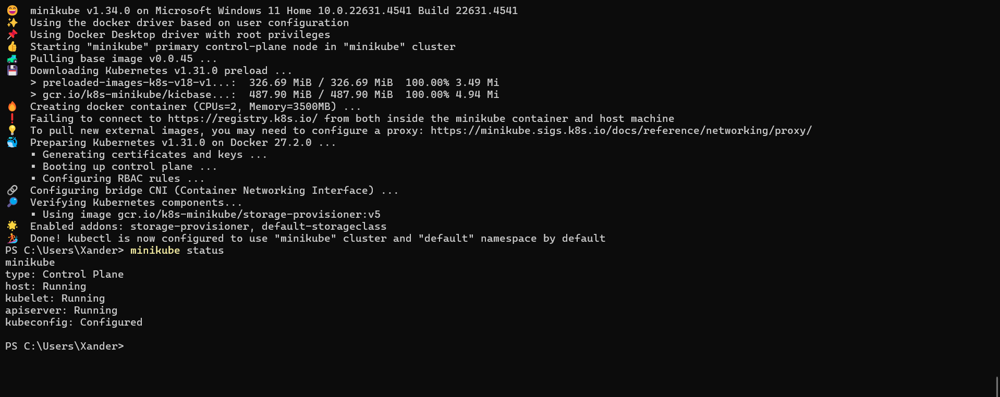
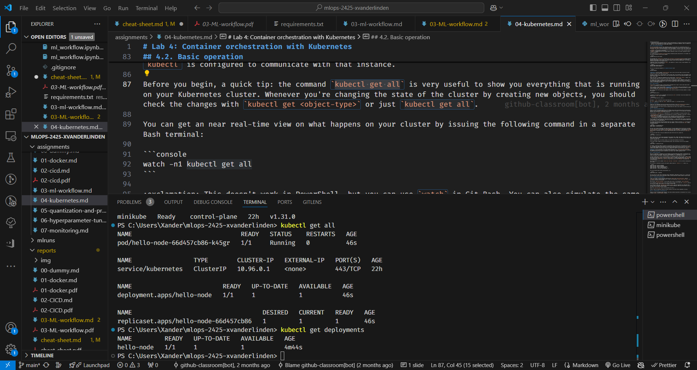
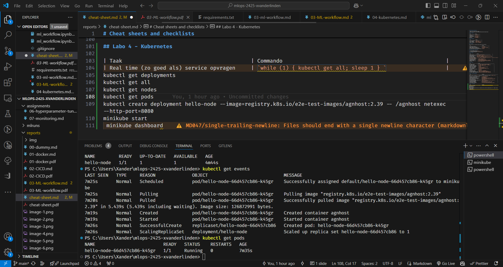
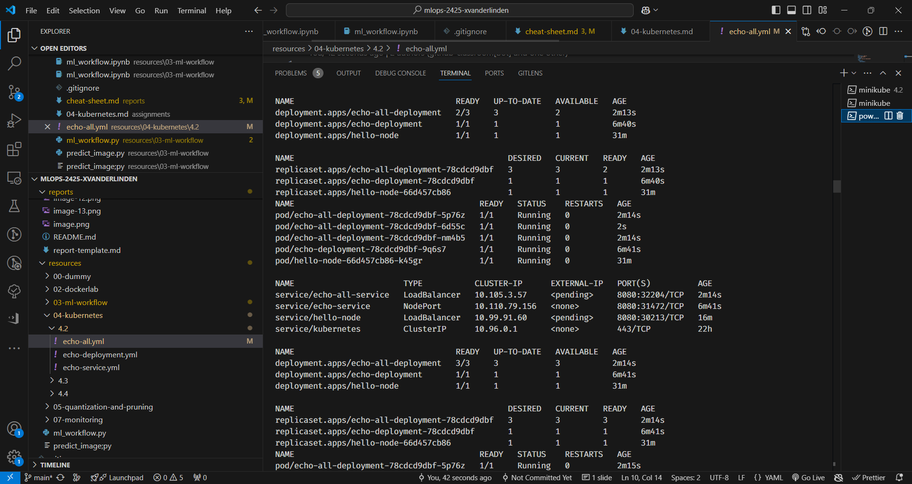
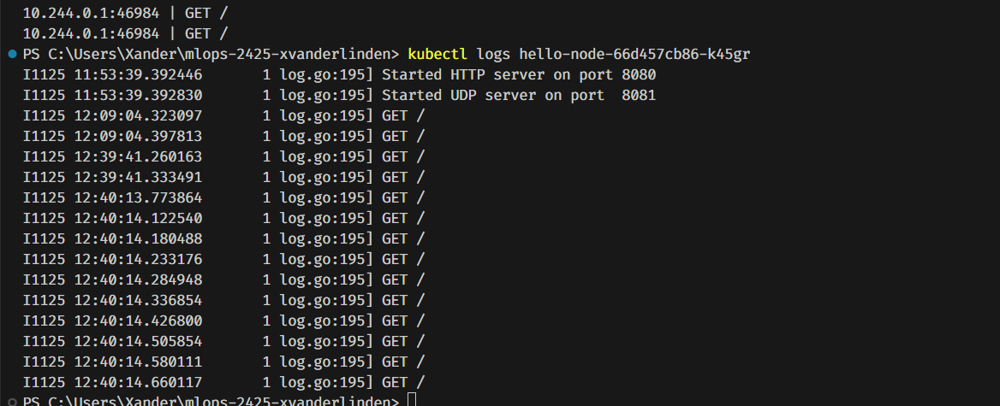
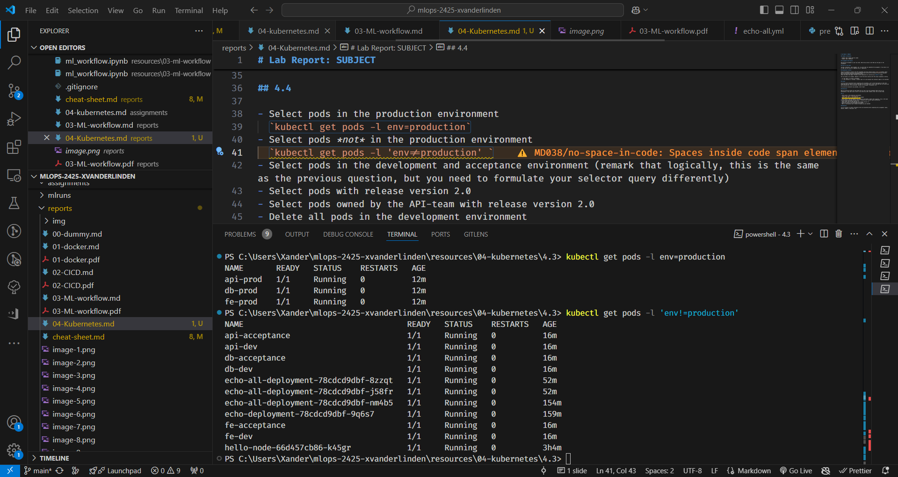
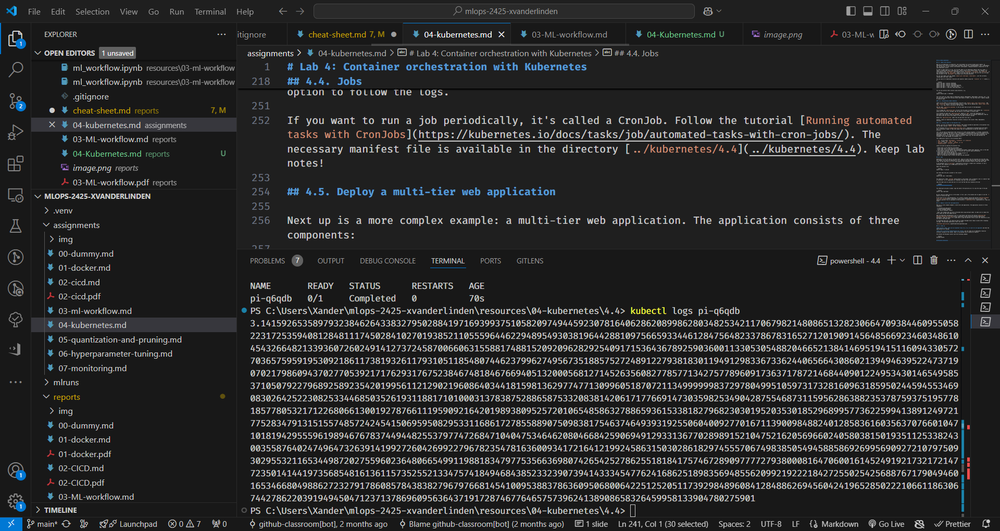

# Lab Report: Kubernetes

## Student information

- Student name: Xander Van der Linden
- Student code: 202292316

## Assignment description

Er werkt gewerkt met Kubernetes voor meerdere container op te zetten in een minikube cluster. Het meeste werk gebeurde via de command line en via .yaml bestanden. We hebben geleerd hoe je containers deployed en labeled. Ook hebben we gezien hoe je jobs en cronjobs kunt uitvoeren. Hoe je parameters kunt aanpassen via de Yaml of de command line. Op het einde werd een webserver van kubernetes online gezet. Het doel was om te leren werken met kubernetes en hier wat containers mee op te zetten.

## Proof of work done

## Evaluation criteria

-[x] Demonstrate that your Kubernetes cluster is running and that you are able to manage it:
  -[x] Open the dashboard to show what's running on the cluster: nodes, pods, services, deployments, etc.
  -[x] Also show these from the command line (using `kubectl`)
-[x] Show that all applications from this assignment are running on the cluster.
  -[x] Show the resources for each application using the dashboard or the command line.
  -[x] If possible, open the application in a web browser and show it works.
-[x] Show that you can scale up and down the number of replicas of an application.
-[x] Show that you can add, remove or change labels and selectors.
-[x] Show that you can manipulate Kubernetes resources using labels and selectors.
-[x] Show that you wrote an elaborate lab report in Markdown and pushed it to the repository.
-[x] Show that you updated the cheat sheet with the commands you need to remember.

## Issues

none

## Reflection

Deze opdracht heeft mijn begrip van kubernetes vergroot. Dit gaat nuttig zijn voor de volgende labo's en op de werkvloer. Het was allemaal nog wat nieuw maar door de cheatsheet zal ik hopelijk de commando's onthouden voor verder gebruik.

## 4.4 vragen

- Select pods in the production environment
  `kubectl get pods -l env=production`
- Select pods *not* in the production environment
  `kubectl get pods -l 'env!=production'`
- Select pods in the development and acceptance environment (remark that logically, this is the same as the previous question, but you need to formulate your selector query differently)
  `kubectl get pods -l 'env in (development, acceptance)'`
- Select pods with release version 2.0
  `kubectl get pods -l release_version=2.0`
- Select pods owned by the API-team with release version 2.0
  `kubectl get pods -l team=api,release_version=2.0`
- Delete all pods in the development environment
  `kubectl delete pods -l env=development`
- What is the quickest way to launch the pods you just deleted?
  `kubectl apply -f 4.3/example-pods-with-labels.yml`

## Resources

<https://kubernetes.io/docs/concepts/overview/working-with-objects/labels/>
<https://kubernetes.io/docs/concepts/configuration/overview/>